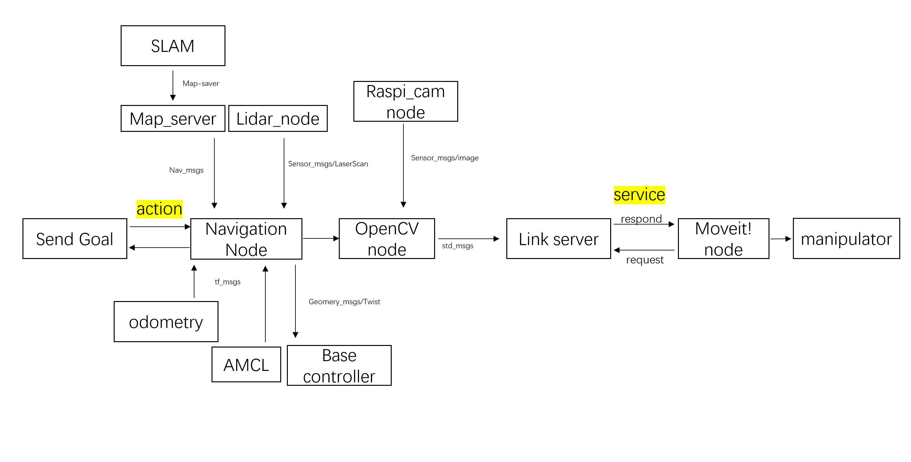

# 🫐 Blueberry Picking Robot Using Turtlebot and ROS 🤖

Welcome to the **Blueberry Picking Robot** project! The goal of this project is to develop a robot that can autonomously navigate, detect, and pick blueberries using TurtleBot3 and the Robot Operating System (ROS). 🌿

## Abstract 📄

In this project, we designed and implemented a robotic system that combines ROS-based navigation, visual recognition, and robotic arm control to automate the task of picking blueberries. The system uses SLAM for mapping, OpenCV for visual recognition, and a manipulator to grasp and pick(not achieved "approach") the detected blueberries. The entire process is using ROS, ensuring modularity, reusability, and easy integration of different functionalities.

## Software and Hardware Platforms 🛠️

### Software
- **Operating System:** Ubuntu 16.04
- **Robot Operating System (ROS):** Kinetic
- **Vision Processing:** OpenCV
- **Robot Control:** MoveIt!

### Hardware
- **Robot Base:** TurtleBot3
- **SBC:** Raspberry Pi
- **Depth Camera:** (Initially intended) Intel RealSense D435 (Used: Raspberry Pi Camera Module)
- **Lidar Sensor:** LDS-01
- **Manipulator:** ROBOTIS OpenManipulator
- **Power Supply:** Lithium Battery

## Project Architecture 🏗️

The overall architecture of the project integrates multiple ROS nodes that handle different aspects of the robot's functionality, from navigation to visual recognition and manipulation. Below is a diagram of the system architecture.

## Implementation Timeline 🗓️

### Week 1: Setting Up the Environment 🌱
- **Objective:** Solve the issue of TurtleBot3 being unable to communicate via Wi-Fi.
- **Key Activities:**
  - Reinstalled Ubuntu 16.04 and ROS Kinetic.
  - Configured the main computer and Raspberry Pi for SSH remote control.
  - Updated OpenCR firmware and successfully connected TurtleBot3 to the computer.

### Week 2: Basic Control and Wi-Fi Configuration 🔧
- **Objective:** Test the remote control of TurtleBot3 and further familiarize with Ubuntu.
- **Key Activities:**
  - Ran the Teleop node to control the robot’s movement via keyboard.
  - Solved IP address issues by setting static IPs.
  - Learned to start `roscore` correctly.

### Week 3: ROS Communication Basics 📡
- **Objective:** Understand ROS communication methods (topics, publishers/subscribers, actions).
- **Key Activities:**
  - Created a ROS package and wrote a node for controlling the robot’s motion.
  - Implemented a simple publisher to control the robot's speed.

### Week 4: SLAM and Mapping 🗺️
- **Objective:** Break down the project and start with SLAM mapping.
- **Key Activities:**
  - Learned and implemented SLAM using TurtleBot3.
  - Successfully mapped the environment and saved the map.
  - Created a Lidar data publisher for obstacle detection.

### Week 5: Navigation with move_base 🧭
- **Objective:** Set waypoints and navigate TurtleBot3 using ROS navigation stack.
- **Key Activities:**
  - Conducted navigation experiments with move_base.
  - Adjusted costmap parameters for efficient path planning.
  - Solved issues related to odometry and power supply.

### Week 6: Blueberry Detection with OpenCV 📷
- **Objective:** Implement visual recognition for blueberry detection.
- **Key Activities:**
  - Configured a Raspberry Pi camera for 2D blueberry detection.
  - Developed an OpenCV node to detect blueberries using HSV color space.
  - Handled issues with ambient light affecting detection.

### Week 7: C++ Implementation and System Integration 🔗
- **Objective:** Develop and integrate the ROS nodes for blueberry recognition and arm control.
- **Key Activities:**
  - Wrote C++ code for blueberry detection and coordinate publishing.
  - Designed and printed a 3D camera bracket for the manipulator.
  - Created a service node to coordinate visual data and arm movements.

### Week 8: Arm Control and Service Linkage 🤖
- **Objective:** Develop the link_service node and arm control functions.
- **Key Activities:**
  - Installed and configured the arm operation dependencies.
  - Implemented service callbacks and integrated them with arm control.
  - Tested and fixed issues with arm movement and cable management.

### Week 9: Final Integration and Testing 🛠️
- **Objective:** Complete the integration of the service client and robotic arm functionality.
- **Key Activities:**
  - Developed a C++ client to execute arm movements based on detected blueberries.
  - Implemented error handling and retry mechanisms.
  - Created launch files for streamlined node initialization(not yet finnished).
